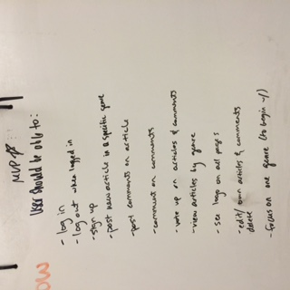
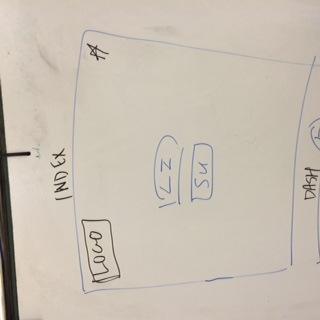
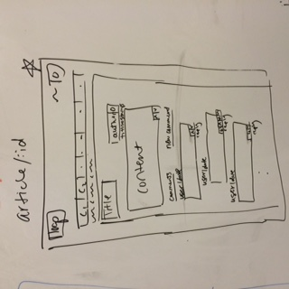
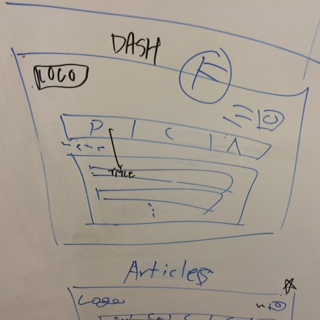
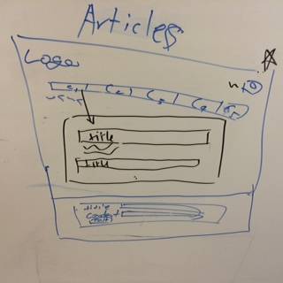
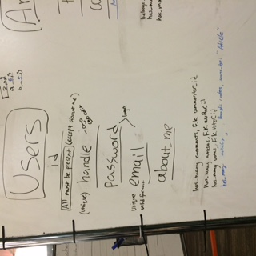
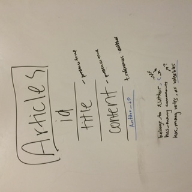

#GameOverflow
**MVP**

As a user, I want to:
* See header on all pages (Header includes logo,ect.)
* View all articles and their comments
* Post a new article
* Post comments on an article
* Edit and delete articles and comments
* Comment on comments
* Vote up comments
* Vote up articles

**ICEBOX**

As a user, I want to:
* Sign up for site
* Log in, and log out of site
* Include logout into header
* Edit and delete articles and comments -written by author-
* Create user dash
* View user's recently commented posts on dash
* View user's voted up articles and comments
* View user's comments
* Sortable comments and articles (Sort by popularity, date, ect.)
* Give articles a category
* Introduce categories bar
* Add tags for articles (game names, games features, anything!)
* Search by tags
* Vote down comments and articles
* Use Google API

**Wireframes**

**Assignments**

* Xiran:
  * Done: Recursive Commenting
  * TODO: Votes, rewrite routes for comments with articles
* Jensen: finish article views, make article polymorphic,
* AJ: Category model,
* Rebecca: User model, signup/login(session, controller)
